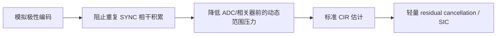

# UWB 模拟域 SYNC 极性编码用于通信–感知干扰抑制：可行性分析

> [!summary] 结论先行
> 该方向**物理机制成立、实现路径清晰，值得优先做低成本可行性实验**，但目前还不能直接宣称“目标无损恢复、通信 SYNC 完全抵消、复杂度严格为 $O(1)$”。更准确的机制是：发射和接收两次极性编码使目标回波受到编码序列的**延迟自相关**加权，而只经过接收端一次编码的 legacy 通信干扰受到编码序列的**零频响应/有限窗部分和**加权。方案能否工作，取决于目标时延处的编码自相关是否足够大，以及任意异步干扰窗口内编码部分和是否足够小。

关联：[[MobiCom27-规划]]、[[UWB解调与SIC流水线]]、[[DW1000单音相位噪声与Cancellation影响分析]]、[[UWB包头PLL相位分析]]

## 1. 方案描述

设一个 sensing packet 的第 $k$ 个 SYNC repetition 施加极性码

$$
c_k\in\{+1,-1\},\qquad k=0,\ldots,N-1,
$$

发射信号为

$$
x_s(t)=\sum_{k=0}^{N-1}c_k s(t-kT_s).
$$

接收前端按照本地时钟施加同一极性波形 $c_{\rm rx}(t)$，再将信号送入芯片原有相关器。对于感知回波，编码在发射路径和接收路径各作用一次；对于外部 legacy 通信信号，只在接收路径作用一次。因此两类信号经历了不同的等效滤波：

- 目标回波由编码的延迟自相关决定；
- 重复通信 SYNC 由编码的有限窗和及其对 CFO 的频率响应决定；
- 随机 Payload/STS 不会获得同样的确定性零点，主要依赖非相干平均。

这比“因为 $c_k^2=1$，目标必然恢复”更完整。$c_k^2=1$ 只对应**零时延且切换严格对齐**的特殊情况。

## 2. 统一信号模型

### 2.1 目标回波：由编码自相关而非单纯平方决定

若目标双程时延为

$$
\tau=\frac{2R}{v_c},
$$

其中 $v_c$ 为光速，则解扩后的目标项为

$$
r_s'(t)=\alpha\,c_{\rm rx}(t)c_{\rm tx}(t-\tau)x_0(t-\tau).
$$

当 TX/RX 使用同一离散码、且 $\tau=dT_s+\delta$ 时，完整 repetition 上的相干增益近似由非周期自相关

$$
A_c[d]=\sum_k c_kc_{k-d}
$$

决定，分数时延 $\delta$ 还会产生编码切换边界的部分失配。因此更合适的目标保持指标是

$$
G_s(d)=\frac{|A_c[d]|^2}{(N-|d|)^2},
$$

而不是笼统写成 $c(t)c(t-\tau)\approx1$。

> [!important] 对交替码的一个反直觉结论
> 对 $c_k=(-1)^k$，整数 repetition 延迟下有 $c_kc_{k-d}=(-1)^d$。因此只要相关窗口处理得当，目标仍可相干累积，但整体符号随 $d$ 的奇偶变化；它不一定损失幅度，却会引入**距离相关的 $0/\pi$ 相位翻转**。分数时延和有限包边界才是主要幅度损失来源。若后端使用复 CIR，相位翻转可校准；若跨距离单元直接做相干融合，则必须显式处理。

对于持续时间为 $T_c$ 的矩形码片，粗略地说，每次切换附近约 $|\delta|$ 的波形区间会发生符号失配。切换越频繁，给定时延/定时误差下的累计边界损失越大。因此“可探测距离”不能只由 $\tau<T_s$ 判断，而应由**切换周期、有效积分窗口和允许的 CIR 增益损失**共同定义。

### 2.2 通信 SYNC：由编码频率响应决定

若外部通信 SYNC 的第 $k$ 次相关输出为

$$
y_k=Ae^{jk\phi}+e_k,\qquad \phi=2\pi\Delta fT_s,
$$

编码后累积为

$$
I_c=A\sum_{k=0}^{N-1}c_ke^{jk\phi}+\sum_{k=0}^{N-1}c_ke_k.
$$

定义编码响应

$$
H_c(\phi)=\sum_{k=0}^{N-1}c_ke^{jk\phi}.
$$

平衡码的 $H_c(0)=0$，因此它在“相邻 SYNC 完全相同”处制造一个零点。问题本质上不是一般意义上的干扰消除，而是用模拟编码为重复干扰设计一个时间域陷波器。

对于偶数 $N$ 的交替码 $c_k=(-1)^k$，相对普通同极性累积的功率比为

$$
\eta_{\rm CFO}=
\frac{|H_c(\phi)|^2}{|H_1(\phi)|^2}
=\tan^2\left(\frac{\phi}{2}\right)
=\tan^2(\pi\Delta fT_s),
$$

小 CFO 条件下

$$
\eta_{\rm CFO}\approx(\pi\Delta fT_s)^2.
$$

原讨论中的该推导是正确的，但它依赖：偶数个完整 repetition、相同积分窗口、无饱和/AGC 状态变化，并且分母没有落在相干累积自身的零点附近。

### 2.3 随机失配：应使用 differential EVM 或相干性

一对相邻 repetition 的差分残余为

$$
z_m=y_{2m}-y_{2m+1}.
$$

若两次误差独立同分布，$E|e_k|^2=\sigma_e^2$，则

$$
E|e_{2m}-e_{2m+1}|^2=2\sigma_e^2.
$$

但实际硬件失真往往并非独立。固定 IQ imbalance、稳定滤波响应和慢变 PA 失真会以共模形式出现，能够被差分部分抵消；短期相位噪声、采样抖动、定时漂移、AGC 切换和随机噪声才构成主要 floor。

若相邻 repetition 功率相等，并定义

$$
\rho_{\rm SYNC}=\frac{E[y_ky_{k+1}^*]}{E|y_k|^2},
$$

则相邻差分与同相累积的平均功率比近似为

$$
\eta_\rho=
\frac{E|y_k-y_{k+1}|^2}{E|y_k+y_{k+1}|^2}
=\frac{1-\operatorname{Re}\{\rho_{\rm SYNC}\}}
{1+\operatorname{Re}\{\rho_{\rm SYNC}\}}.
$$

这一公式比静态 EVM 更适合作为实验前的可行性预测器。应分别测量幅度一致性、相位增量分布和复相干系数，而不只报告单个 EVM 数值。

## 3. 异步到达是方案的核心问题，不是边角问题

实际通信包相对 sensing 编码窗口具有任意偏移 $q$。即使完整码字满足

$$
\sum_{k=0}^{N-1}c_k=0,
$$

通信 SYNC 也可能只覆盖一段长度为 $L$ 的编码窗口，残余由

$$
S_c(q,L)=\sum_{k=q}^{q+L-1}c_k
$$

决定。因此需要使用以下两个指标评价编码：

$$
B_{\max}(L)=\max_q|S_c(q,L)|,
$$

$$
B_{\rm rms}(L)=\sqrt{E_q|S_c(q,L)|^2}.
$$

交替码的优势是任意整数对齐窗口中 $|S_c(q,L)|\le1$，对未知包偏移非常强；块码 $[+,+,-,-]$ 或更长正负块的最坏部分和更大，在干扰只覆盖局部窗口时会留下明显残余。另一方面，交替码切换最频繁，硬件瞬态和分数时延失配也最大。这说明编码选择的真实权衡是：

$$
\text{异步窗口抑制}
\leftrightarrow
\text{CFO 鲁棒性}
\leftrightarrow
\text{目标延迟自相关}
\leftrightarrow
\text{切换次数与瞬态}.
$$

此外，通信 repetition 与本地编码区间可能存在非整数偏移。此时单个通信 SYNC 会跨越极性边界，既可能得到额外抑制，也可能因相关器窗口、脉冲成形和开关瞬态产生不可预测残余。必须做连续偏移扫描，不能只枚举整数 $T_s$ 偏移。

## 4. 目前论证中需要修正的四个点

### 4.1 “两次编码后必然恢复”不够准确

正确说法是：目标回波乘上 $c(t)c(t-\tau)$，其保持程度由编码在目标时延处的自相关决定。只有在零时延、同一码片内部，或特定序列的可校准延迟下，才可近似无损恢复。

### 4.2 “标准相关器无需修改”需要硬件拓扑支持

要让内部标准相关器看到解扩后的波形，接收路径必须在 ADC/相关器之前完成极性恢复，并且控制时序必须与实际 TX 时刻锁定。至少存在三种拓扑：

1. TX、RX 各放置一个受同一时基控制的极性开关；
2. 在共用天线馈线上放置一个双向开关，发射和回波分别经过一次；
3. 只编码 TX，在可访问的数字前端或相关器模板中完成 RX 解码。

其中前两种才符合“模拟域双遍编码”。必须确认 QM35825 的收发路径、双工/耦合结构和 radio-event 时序接口是否允许该操作。若只能通过包络检测触发，还需要量化触发延迟均值、抖动和温漂。

### 4.3 复杂度比较不能写成严格下界

原始 IQ 整包缓存量

$$
M=2bf_sT_p
$$

是全速、逐样本、离线/块式 SIC 的典型实现成本，而不是所有数字 SIC 的理论最低成本。流式重构、分块 cancellation、片上相关域消除或仅保存参数的实现可以降低缓存。因此论文中建议写成：

> 与本文采用的 packet-scale waveform SIC baseline 相比，固定/可生成的模拟极性码只需少量状态和定时控制，避免原始 GHz 级 IQ 在存储层级间搬运。

对于固定交替码，控制状态确实可近似为 $O(1)$；对于任意长度为 $N$ 的查表码，状态是 $O(N)$ bit；对于 LFSR/计数器生成码，则是 $O(\log N)$ 或固定寄存器规模。应报告实际 bit 数、开关频率、功耗和插损，而非只给渐近复杂度。

### 4.4 对 Payload/STS 的作用需要实测分解

“Payload 随机所以会被平均”只有在累积次数足够、数据/加扰种子变化且接收处理没有把某些结构重新相干化时成立。若干扰包重复发送相同 payload、使用固定 STS 配置，或相关窗口内存在确定性 PHR/SFD 结构，残余可能并不随机。实验应按字段分别测量其对 CIR 的贡献，而不是预先把所有非 SYNC 字段归为噪声。

## 5. 编码设计不应只比较三种手工序列

可将长度 $N$ 的二进制码设计为多目标优化：

$$
\min_{c_k\in\{\pm1\}}
\lambda_1\max_{q,L\in\mathcal L}|S_c(q,L)|
+\lambda_2\max_{\phi\in\Phi}|H_c(\phi)|
+\lambda_3N_{\rm switch}
+\lambda_4\max_{d\in\mathcal D}\bigl(1-G_s(d)\bigr).
$$

其中：

- $\mathcal L$：可能重叠的通信 SYNC 长度集合；
- $\Phi$：实测 CFO/短期相位变化范围；
- $N_{\rm switch}$：极性切换次数；
- $\mathcal D$：目标距离对应的时延集合。

建议至少比较：

| 编码 | 异步部分和 | CFO | 切换开销 | 目标延迟响应 |
| --- | --- | --- | --- | --- |
| 全 $+1$ | 无抑制 | baseline | 最低 | 最平坦 |
| $[+,-]$ 交替 | 最优或近最优 | 相邻配对最强 | 最高 | 相位随整数延迟翻转，分数延迟敏感 |
| $[++--]$ | 中等 | 配对间隔增大 | 中等 | 短时延边界损失较小 |
| 长块 $[+^B,-^B]$ | 局部窗口较差 | 更易受慢相位漂移影响 | 低 | 小时延保持较好 |
| 搜索得到的平衡码 | 可联合优化 | 可塑造多个零点 | 可约束 | 可约束目标距离区间 |

Walsh、Manchester、m-sequence 等可以作为对照，但创新点不应落在序列名称上。

## 6. 最小可行性验证（按 Go/No-Go 排序）

> [!tip] 建议先用已有 IQ 数据做软件注入
> 在购买或焊接宽带开关之前，先对采集到的 sensing 与 communication 波形离线乘以理想/非理想 $c(t)$，可快速验证理论上限，并把“算法机制失败”与“硬件实现失败”分开。

### 实验 A：确认干扰字段来源

目标：证明值得专门抑制通信 SYNC。

- 分别截取 SYNC、SFD/PHR、STS、Payload，在完全相同的 CIR 累积流程下测量干扰能量；
- 扫描 sensing 积分 repetition 数 $N$，检查 SYNC 是否近似按 $N^2$ 增长，而随机字段接近 $N$；
- 改变 payload 内容、packet repetition 和 STS 配置，判断哪些字段实际具有跨包相干性。

**Go 条件：** SYNC/其他确定性字段在目标 CIR 区间贡献主导，且相对随机字段随积累长度显著增长。

### 实验 B：测量相邻 SYNC 可抵消上限

目标：不引入目标回波，只评估通信干扰的 differential floor。

- 对每个设备、信道、PRF、功率、温度和包间隔测量 $\rho_{\rm SYNC}$；
- 测量 $y_k-y_{k+1}$ 与 $y_k+y_{k+1}$ 的功率比；
- 将实测结果与 $\tan^2(\pi\Delta fT_s)$ 预测分离，估计 CFO、相位噪声和幅度失配各自贡献。

**Go 条件：** 实测差分抑制稳定高于论文需要的门槛，并在跨 packet/capture 条件下可复现。

### 实验 C：二维异步偏移扫描

目标：排除只在理想对齐点有效的情况。

- 横轴扫描通信包相对 sensing packet 的连续时间偏移；
- 纵轴扫描 CFO 或设备组合；
- 对每个编码报告 median、5th percentile 和 worst-case suppression；
- 单独标出通信 SYNC 只覆盖编码窗口头部/尾部的边界情况。

**Go 条件：** 不依赖精确协同，在任意 offset 下仍有可接受的统计增益，且最坏情况不会放大干扰。

### 实验 D：目标距离与编码自相关

目标：验证干扰抑制没有以牺牲 sensing 为代价。

- 用延迟线或离线波形注入扫描 $\tau$，覆盖完整预期距离；
- 测量主峰增益、CIR 相位、旁瓣、range bias 和虚假峰；
- 比较交替码、块码、优化码和无编码；
- 对开关边界附近做更细的分数时延扫描。

**Go 条件：** 目标检测率/估距误差在工作距离内不显著恶化，距离相关相位可稳定校准。

### 实验 E：真实模拟前端

目标：量化从离线理想模型到硬件的损失。

- 先测 S 参数：全带宽插损、两状态幅度差、相位误差、群时延差；
- 再测切换瞬态、控制抖动、温漂和强干扰下线性度；
- 比较理想软件编码、回放编码和在线模拟编码的 suppression gap；
- 检查开关瞬态是否在 CIR 中形成固定伪影，可否通过 blanking/calibration 去除。

## 7. 评价指标与图表建议

不要只报告 cancellation dB。建议形成从机制到应用的四层指标：

1. **波形层：** $|H_c(\phi)|$、$S_c(q,L)$、$A_c[d]$、相邻 $\rho_{\rm SYNC}$；
2. **相关层：** 通信 SYNC 相关峰抑制、CIR residual power、旁瓣变化；
3. **感知层：** detection probability、false alarm rate、range/velocity error、最弱可检测目标；
4. **系统层：** 插损、功耗、开关速率、触发抖动、面积/器件数、相对 SIC 的延迟与数据搬运量。

最有说服力的图可能是：

- **机制图：** sensing 回波穿过编码器两次，legacy 干扰只穿过一次；
- **二维热力图：** suppression vs. packet offset 与 CFO；
- **距离曲线：** 目标保持增益和相位 vs. range；
- **Pareto 图：** interference suppression vs. sensing loss/开关次数；
- **系统结果：** 弱目标 ROC，对比 no mitigation、模拟编码、数字 SIC、模拟编码 + residual SIC。

## 8. 与数字 SIC 的合理关系

该方案不必把 SIC 描述成竞争对手，更强的系统故事是分层协同：

- 模拟编码优先处理最结构化、最容易相干增长的 SYNC；
- 数字 SIC 处理 CFO、异步边界、Payload/STS 和硬件失配留下的残余；
- 二者组合有机会减少 SIC 需要处理的动态范围、候选数和迭代次数。

这也与当前 [[UWB解调与SIC流水线]] 形成自然衔接：现有 SIC 可作为上界 baseline、残余分析工具和后级模块，而不是被完全替代。

## 9. 创新性与论文叙事边界

不建议声称发明了交替极性、Walsh coding 或 BPSK spreading。可辩护的贡献应落在以下组合上：

1. **新问题机制：** 揭示 legacy UWB 通信 SYNC 在 sensing CIR 累积中的相干增长，而随机字段表现不同；
2. **物理层不对称利用：** 通过双遍/单遍编码的不对称，在不解调干扰源的情况下阻止其进入相干累积；
3. **面向异步共存的编码设计：** 联合优化有限窗部分和、CFO 频响、目标延迟自相关和硬件切换代价；
4. **商用兼容实现：** 在不改动芯片内部标准相关器的前提下实现并校准宽带模拟极性切换；
5. **系统级证据：** 相对 packet-scale SIC 显著降低数据搬运/延迟/功耗，同时保持弱目标检测性能。

> [!warning] 创新性尚未完成检索
> 本笔记只分析了讨论中的技术逻辑，没有完成对 analog cancellation、RF-domain spreading/despreading、backscatter 双遍编码、UWB radar interference mitigation、Walsh-coded radar 等方向的系统文献和专利检索。在确定论文主张前，应单独完成 prior-art matrix。

## 10. 总体风险判断

| 风险 | 严重度 | 当前判断 | 最快验证方式 |
| --- | --- | --- | --- |
| SYNC 并非主要干扰来源 | 致命 | 未验证 | 字段级 CIR 能量分解 |
| 任意 packet offset 下抵消失效 | 高 | 交替码有希望，分数偏移未知 | 连续 offset 软件注入 |
| 目标回波因时延而不能解扩 | 高 | 整数延迟可相干，边界损失待测 | 延迟扫描与 $A_c[d]$ 测量 |
| 开关瞬态制造 CIR 伪影 | 高 | 强依赖器件与布局 | S 参数 + 时域脉冲测试 |
| QM35825 无稳定控制时序 | 高 | 未确认 | GPIO/event 或包络触发抖动测试 |
| CFO/相位噪声形成高 floor | 中高 | 可由 $\rho_{\rm SYNC}$ 预测 | 现有 capture 直接测差分 |
| 对 legacy/法规兼容性有影响 | 中高 | 取决于编码位置和辐射波形 | 频谱、PSD、标准接收测试 |
| 创新性不足 | 中高 | 序列本身不新，系统组合可能新 | 文献/专利检索矩阵 |
| “$O(1)$ vs. $O(N)$”被审稿人反驳 | 中 | 原表述过强 | 改为实际硬件成本比较 |

## 11. 建议的近期决策

优先级不应是立即做高速相位板，而是依次回答三个问题：

- [ ] **干扰值得抑制吗？** 完成字段级相干增长分析，确认 SYNC 主导程度。
- [ ] **理想编码有效吗？** 用已有 IQ 做编码、CFO、目标时延和连续异步偏移的四维软件注入。
- [ ] **硬件值得做吗？** 由实测 $\rho_{\rm SYNC}$、最坏 offset suppression 和目标保持增益共同决定。

若前三项成立，再推进：

- [ ] 建立候选器件指标表，重点看工作带宽、两状态幅相不平衡、群时延、切换时间、P1dB、NF/插损；
- [ ] 确认 QM35825 TX start/radio event 的可观测性和抖动；
- [ ] 设计交替码与一个低切换优化码的 FPGA/CPLD 控制原型；
- [ ] 将模拟编码结果接入现有 SIC，验证 hybrid 方案是否减少 residual 和处理开销；
- [ ] 单独开展 prior-art 与专利检索，再冻结论文 contribution wording。

## 12. 一句话论文主张（暂定）

> 我们利用 UWB sensing 回波与 legacy 通信干扰在模拟编码器中的“双遍/单遍”不对称性，在信号进入标准 CIR 相干累积前选择性破坏通信 SYNC 的相干性，并联合设计编码以兼顾异步包偏移、振荡器误差、目标时延和低成本宽带硬件约束。

该表述比“使用 $[+1,-1]$ 抵消 UWB SYNC”更能体现问题、机制、设计与实现四个层次，也为与数字 SIC 的互补关系留下空间。
