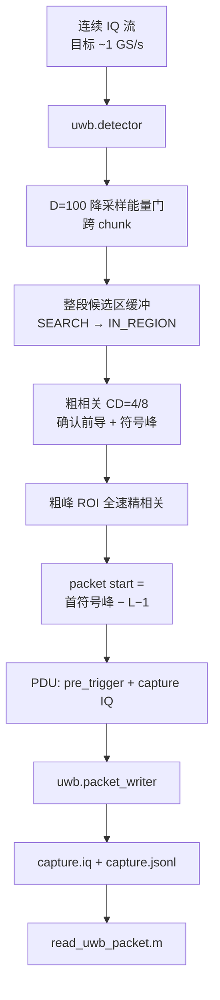
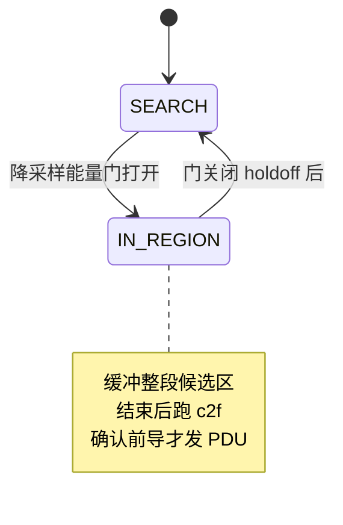

# 当前 UWB 信号检测逻辑（图文版）

> 更新日期：2026-08-08  
> 与 `../../开发状态.md` 同步。生产路径以 **`uwb.detector` + `uwb.packet_writer`** 为准。

---

## 1. 整体流水线

### 1.1 生产路径（推荐）



### 1.2 调试 / 对照路径

```text
IQ → energy_detector      （全速率能量 metric + flag）
IQ → preamble_detector    （Reference / 能量门 / coarse-to-fine，双输出）
```

> dual-output 的 flowgraph 吞吐 ~80–150 MS/s，**不作为** 1 GS/s 截包部署路径。

---

## 2. Energy Detection

```math
energy[j] = \frac{1}{W}\sum_{m=0}^{W-1}|x[j+m]|^2
```

- 实现：`uwb_window_energy()` / 降采样门 `uwb_energy_gate_strided()`
- 生产：D=100 步进取样，跨 chunk 保持门状态
- 调试块吞吐：约 80–90 MS/s（受 flowgraph 下限影响）

---

## 3. Preamble Detection

### 3.1 归一化相关

```math
metric[j]=\frac{|corr[j]|^2}{winpow[j]\cdot E_t+\epsilon}
```

- 模板 L2 归一化；峰值在**符号结束**位置
- GR FIR：taps = `conj(template)` **逆序**

### 3.2 三档模式（`preamble_detector`）

| 模式 | 条件 | 约吞吐 |
|------|------|--------|
| Reference | `energy_threshold ≤ 0` | ~7.8 MS/s |
| 能量门 fast | 门限 >0，D_energy≤1 | ~66 MS/s |
| coarse-to-fine | `energy_decimation>1` | ~80–118 MS/s（dual out） |

**core 粗扫算法**独立 benchmark：**>1 GS/s**。

---

## 4. UwbDetector 状态与截包

### 4.1 状态（合并后）



### 4.2 截取区间

```text
[start − pre_trigger, start + capture)
默认 pre≈2032, capture=200000 → 共约 202032 样本
```

- `start`：精相关首符号峰 − (L−1)（真实 cfile：**4,992,001** ≈ 真值 4,992,000）
- `detection_metric`：精相关峰值（实测 **1.0**）
- 截取 IQ 与真值：**diff=0**

### 4.3 RingBuffer / 区域缓冲

- 预触发与门延迟前样本依赖缓冲
- **整段候选区缓冲**消除 chunk 边界丢峰（相对流式 `preamble_detector`）
- Ring 本身不提升吞吐；正确性结构

---

## 5. Packet Writer 与读回

```text
PDU (CF32) → 量化 SC16 → capture.iq（交错 int16 I/Q，每样本 4 字节）
           → capture.jsonl（metadata + sample_format=sc16 + iq_scale）
可选 one_file_per_packet → packet_<id>.iq + jsonl.file
重建：float ≈ int16 / iq_scale
```

```matlab
[x, meta] = read_uwb_packet('capture.iq', 'capture.jsonl', packetId);
```

I/O 仅在每包消息 handler 中，不进入逐样本 `work()`。

---

## 6. 性能与目标对照

| 场景 | 状态 |
|------|------|
| 5 ms 静默 + ~200 μs 包，精确截取写盘 | ✅ 已 e2e 验证 |
| 算法静默路径 ~1 GS/s 量级 | ✅ core 实测 |
| dual-output 全速率 metric 实时 1 GS/s | ❌ 不推荐、未达标 |
| 多包 / 极短间隔 | ⏳ 待测 |
| detector 专用 1 GS/s 压测数字 | ⏳ 待补 |

---

## 7. 参考源码

| 文件 | 职责 |
|------|------|
| `uwb_detector_core.h` | 能量 / 粗峰 / 状态机 |
| `uwb_detector.{h,cc}` | 生产截包 + PDU |
| `uwb_packet_writer.{h,cc}` | 写盘 |
| `uwb_preamble_detector.*` | 流式检测对照 |
| `read_uwb_packet.m` | MATLAB 读包 |
| `test_uwb_detector.py` / `test_packet_writer.py` | e2e |

更完整的进度与下一步见 **`../../开发状态.md`**。
