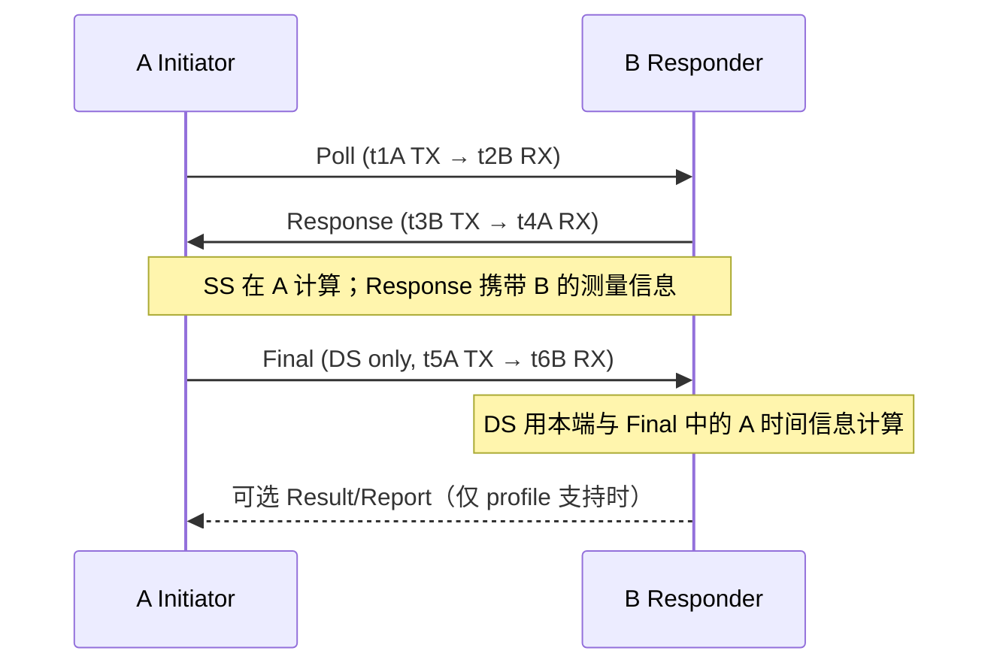

# UWB SS-TWR / DS-TWR 开发需求

日期：2026-09-28。分支：`feature/uwb-ds-twr`，起点：`b897677`。
状态：需求基线 v0.1；TWR 功能尚未实现。API 名称和目录布局为设计契约草案。

本需求是此分支 TWR 开发的主要依据，配套阅读
[开发路线与验收矩阵](开发路线与验收矩阵.md)和
[参考资料与API映射](参考资料与API映射.md)。仓库既有 TX/RX、radar 和 MATLAB
功能作为复用及回归基线。历史“只做检测截取，不做实时解调”的范围限制不适用于本分支。

## 1. 目标与两阶段范围

实现可通过 Python 配置和运行的完整 Single-Sided Two-Way Ranging（SS-TWR）
与 Double-Sided Two-Way Ranging（DS-TWR），底层使用 GNU Radio C++ 和现有
HRP UWB TX/RX 链路。每种协议均提供 initiator/responder；一次测量包含配置校验、
空口交换、硬件时间映射、ToF 计算、校准、结果输出、错误处理和可重复验证。

| 要求 | 第一阶段：一台 X410 两个 channel | 第二阶段：商用模组互通 |
|---|---|---|
| 端点 | A=TX0/RX0，B=TX1/RX1，实际物理映射可配 | X410 ↔ 指定 DW1000 / DW3000 模组 |
| 协议 | SS-TWR、DS-TWR | SS-TWR、DS-TWR |
| 角色 | A/B 交换 initiator/responder | X410 与每种模组都分别作为 initiator/responder |
| 时钟 | 共享设备时钟；状态机和数据各自隔离 | 独立时钟，测量偏差/漂移并校正 |
| 验证顺序 | 仿真 → 已知延迟双向有线 → 空口 LOS | PHY 双向解码 → SDK 报文 → 测距 → 持续运行 |
| 成果 | 双向真实收包驱动的测距与校准报告 | 固定 SDK/固件/profile 的互通矩阵及结果 |

REQ-SCOPE-01：“完整”指选定能力集合内，两种协议和两端角色的完整闭环。
API 必须能够表达完整参数并查询支持情况，不要求第一版支持所有芯片的全部 PHY 模式。
不支持的组合必须报错，不能静默套用 radar 默认值。

REQ-SCOPE-02：第一阶段共享时钟不能证明独立时钟下的补偿精度。计算路径不得使用
另一端的私有时间戳、共同调度表或已知线路距离代替空口携带的测量信息。
仿真器可保存 ground truth，但必须与端点运行时接口隔离。

REQ-SCOPE-03：第二阶段基线按“模组可刷写参考示例固件，并可配置应答等待时间”设计。
对方若是封闭固件，必须先取得其报文与时序协议。支持 TWR PHY 不代表支持任意成品
模组、FiRa 会话、手机定位协议或厂商私有网络协议。

REQ-SCOPE-04：基线采用不含 STS 的共同 HRP 模式。STS、安全测距、AES、PDOA、
多标签调度与自动发现作为后续能力项；接口允许能力扩展，测试不得把固定 STS 波形
回放称为安全测距。具体模组要求这些能力时，列为该互通 profile 的新增必需项。

## 2. 当前代码可复用部分及缺口

以下路径相对 `gr-uwb/`：

| 现有代码 | 复用内容 | TWR 必需增量 |
|---|---|---|
| `include/gnuradio/uwb/uwb_hrp_mod_core.h`、`lib/uwb_hrp_packet_source.cc` | HRP 波形、PHR、payload 调制、前缀缓存 | 任意 TWR MAC 帧、每报文 timestamp patch、RMARKER 偏移、profile 校验 |
| `uwb_phy_profile.h`、`uwb_demod_core.h`、`lib/uwb_realtime_demodulator.cc` | preamble/SFD、CFO、PHR/payload/FCS 解码 | 共同 PHY 验证、精细首径 ToA、时钟比例及时间映射输出 |
| `lib/uwb_detector_sc16.cc` 与已有截取器 | 未知时间捕获及有界窗口 | 首个 Poll 的捕获、后续协议 RX 窗口、会话路由 |
| `lib/uwb_pdu_rational_resampler_ccf_65_48.cc` / `65_32.cc` | native ↔ work grid 的已有 RX 路径 | 保留时间锚点、群时延和分数样点坐标；QA 验证映射 |
| `uwb_echo_burst_backend.h`、`lib/uwb_uhd_burst_backend.cc` | timed TX/RX、SC16、partial I/O、async 错误 | 同设备两端 TX/RX 资源调度、接收驱动的应答、逐 transaction 时间与错误归属 |
| `uwb_fake_burst_backend.h` | 可重复事件与错误注入的基础 | 两端时钟/传播延迟/丢包/截止时间模型 |
| `uwb_radar_cir_estimator.h` | CIR 估计与相关基础 | 首径及质量判决；不能直接把最大 CIR tap 当成 ToA |

REQ-BASE-01：现有 echo backend 已支持多 TX，但当前 RX 配置围绕一个 `rx_channel`。
第一阶段的两个 TWR 端点需要两条 RX 路由和交替发送能力，不能把“两个 TX + 一个 RX”
的 jamming 拓扑视为已满足要求。复用 backend 的底层能力，TWR FSM 独立于 radar 周期 FSM。

REQ-BASE-02：当前 HRP profile 主要覆盖既有 BPRF、code 9–12、固定速率几何。
配置对象可表达的 PRF、码、速率、PHR/STS 组合必须由实际实现能力限制，逐项验证后开放。
“code 支持”和“某 preamble 长度可发”不能替代对应配置的双向解码测试。

## 3. PHY 与硬件能力

REQ-PHY-01：优先建立共同 profile：UWB channel 5、中心频率 6489.6 MHz、
64 MHz PRF 类别（既有 BPRF mean PRF 为 62.4 MHz）、标准短 SFD、6.8 Mb/s 类别
数据速率、标准 PHR、无 STS、标准长度 PSDU。建议从 code 9、128 preamble 开始，
具体组合必须通过两端 PHY/FCS golden 冻结，不能仅据 API 枚举认定兼容。

REQ-PHY-02：native sample rate、998.4 MS/s work rate、符号速率和 RF 带宽是不同量。
启动时查询并记录 FPGA image、UHD 版本、采样率/带宽读回值、实际 channel/端口映射。
既有 CG400/CG600 配置必须按实际 FPGA 能力检测；普通官方 X410 配置与本地定制配置
分别建档。调谐成功不等于覆盖完整 UWB 频谱。[X410 官方硬件说明](https://files.ettus.com/manual/page_usrp_x4xx.html)

REQ-PHY-03：DW3110 的公开能力包含 channel 5/9，并注明 channel 5 与 DW1000
兼容，因此共同互通优先 channel 5；channel 9 和其他信道按 RF 能力、波形带宽、
滤波与标定结果单独验收。不能预先宣称 X410 全带宽覆盖 channel 9。
[DW3110 产品资料](https://www.qorvo.com/products/p/DW3110)

## 4. Python/API 参数契约

REQ-API-01：提供类型化 Python 配置、C++ 参数结构、JSON 配置导入导出和 CLI 示例。
所有入口采用同一校验器，支持 `capabilities()`、`validate()`、`effective_config()`。
配置包含 schema/profile/calibration 版本，完整保存 requested、effective、硬件 readback。
长度、索引、计时精度不足、冲突字段、NaN/Inf、超容量和不支持组合都必须在启动前拒绝。

| 分组 | 必需可配置项 | 单位与约束 |
|---|---|---|
| 会话 | SS/DS、角色、本端/对端地址、PAN、session/exchange ID、测量次数、间隔、重试/退避 | 帧序号回绕与会话 ID 独立；同端初版一次仅一个在途 exchange |
| PHY | channel、中心频率、TX/RX preamble code、preamble length、PRF 类别、数据速率 | code/PRF/channel/profile 联合校验；信道与频率冲突拒绝 |
| 帧格式 | SFD 类型/长度、SFD timeout、PHR 模式/速率、ranging bit、PSDU/FCS、STS 模式/长度 | 分清应用 payload、MAC PSDU 和是否包含 FCS；只由一层追加 FCS |
| 发射 | 端口、每端 TX gain、数字 IQ amplitude、pulse shaping、TX 功率策略 | gain dB、amplitude 与标定后的功率 dBm 分开；芯片 power word 独立命名 |
| 接收 | 每端 RX gain/AGC、端口、带宽、检测/相关门限、首径门限、PAC 等适配参数 | 芯片专有项经后端能力查询；不能把 PAC 无声映射为任意软件检测步长 |
| 无线设备 | device args、TX/RX channel、native sample rate、clock/time source、FPGA/DPDK | 相同物理通道的资源冲突应拒绝；读回不符启动失败 |
| 每包时间 | Poll 启动时间；Poll→Response、Response→Final、Final→Report 延迟；各 TX 后 RX 开启延迟 | 每个字段带参考事件、协议 RMARKER、单位及要求的量化方式 |
| 超时 | Poll/Response/Final/Report RX window、RX timeout、整次 exchange timeout、重试间隔 | RX timeout 从接收启用时算；整次 timeout 用 monotonic clock 管理 |
| 时戳与校准 | TX/RX 链路延迟、天线/线缆延迟、首径算法、CFO/SFO 补偿、校准 ID | ns/秒/原生 ticks 明确分开；校准只能应用一次 |
| 诊断 | CIR/短 IQ 抽样、原始帧、结果输出、队列容量、统计频率 | 有界内存；诊断 I/O 不在实时处理线程执行 |

REQ-API-02：“每个 packet 的等待时间”拆为发送前的协议应答延迟、TX 后开启 RX
的延迟，以及等待目标 RX 帧的超时。例如 Response 的发送参考是 B 接收 Poll 的
RMARKER；若配置“帧尾后延迟”，必须由精确帧长换算，记录换算结果。
API 使用 SI 时间单位或具名 `Duration`；芯片 UUS、device tick 的换算只在 adapter 内完成。

REQ-API-03：支持每消息类型覆盖，以及 `range_once(overrides=...)` 的单次覆盖。
PHY/频率/增益等影响同步的变更须在 exchange 边界原子生效；正在进行的 exchange
使用不可变配置快照，禁止中途修改 preamble、对端地址或校准参数。

REQ-API-04：候选接口如下，仅为后续开发约定，当前仓库不可直接调用：

```python
from gnuradio import uwb

radio = uwb.twr_radio(device_args=..., endpoint_channels={"A": (0, 0), "B": (1, 1)})
caps = radio.capabilities()
cfg = uwb.TwrConfig.from_json("twr_session.json")
plan = radio.validate(cfg)  # 返回有效 profile、帧长、时间量化、容量和截止时间可行性
session = radio.create_session(plan)
session.start()  # C++ 执行逐包 FSM；Python 不负责亚毫秒调度
result = session.range_once(timeout_s=...)
stats = session.stats()
session.stop(drain=True)
```

REQ-API-05：Python 支持结果迭代器/回调、取消、异常与统计；慢回调不得阻塞无线线程。
提供 SS/DS 两种协议、两个角色、双 channel 本机示例和商用对端示例。
高层 API 借鉴 Decawave 的能力和语义，不承诺与 `dwt_*` 二进制或函数签名兼容。

## 5. 协议、帧和计算

REQ-PROTO-01：每个端点独立维护状态、地址、会话序号、计时器和时间戳。
只有 FCS 正确且地址、序号、消息类型与当前状态匹配的帧才能推进 FSM。
迟到、重复、旧会话、异序帧分别统计；retry 使用可追踪的新 attempt，不混用旧 timestamps。



REQ-PROTO-02：SS 至少使用 Poll/Response。A 需获得 B 的实际接收时刻和合格的
延迟发射时刻，或等价的 turnaround interval。定义：

```text
RA = t4A - t1A       # A 的 round trip
DB = t3B - t2B       # B 的 turnaround
ToF_A = (RA - kAB * DB) / 2
```

先按各自 nominal tick rate 把 interval 转成秒；`kAB` 将 B 的时间间隔换算至
A 的本地时间尺度，共同时钟校准后可为 1。必须定义 clock ratio 的方向、符号、
估计有效期和不确定度。不能在独立时钟测试中无条件置为 1；不能盲目复制芯片 CFO
换算系数，X410 的 RF LO 与采样时钟误差关系需要验证，可采用经过验证的 SFO 估计。
示例芯片驱动用接收诊断估计 SS 时钟偏差，参考资料见 API 映射文档。

REQ-PROTO-03：DS 基线使用三报文 asymmetric DS-TWR，不要求两次回复延迟相等：

```text
RA = t4A - t1A       DB = t3B - t2B
DA = t5A - t4A       RB = t6B - t3B
ToF = (RA * RB - DA * DB) / (RA + RB + DA + DB)
distance = propagation_speed * ToF
```

四个 interval 在计算前转换到一致 nominal 时间单位，使用足够精度避免乘法溢出。
检查时间顺序、分母、范围和时钟状态；保留有符号原始 ToF 与错误原因，不把负值裁成 0
后标为成功。DS 可降低相对时钟偏差的一阶影响，但仍需绝对时标、硬件延迟和漂移验证。
交换及公式参考 [Decawave APS013](https://forum.qorvo.com/uploads/short-url/5yIaZ3A99NNf2uPHsUPjoBLr2Ua.pdf)。

REQ-PROTO-04：Response/Final 携带自身 TX timestamp 时，先完成硬件量化和所有
RMARKER/校准映射，再 patch 帧及重算 FCS、编码调制。带 timestamp 的帧必须用
可预测且有截止时间验证的 delayed TX。若 delayed TX 失败，该次交换失败，禁止
即时补发并沿用原 timestamp。立即发射只能用于不需自带 TX timestamp 的帧，或
采用双方显式支持的 follow-up profile。

REQ-PROTO-05：SS 基线结果在 A 可用，DS 基线在 B 可用。两端都需要结果时，
使用 profile 指定的 Report 或外部管理读取；普通数据 Report 不改变 SS/DS 公式。
对方官方三报文示例不支持 Report 时不能强行增加报文并声称原版互通。

REQ-PROTO-06：实现独立 frame codec/profile，明确 FCF、PAN/address、sequence、
function code、字节序、timestamp 宽度和单位、FCS 范围。IEEE PHY 兼容不保证 TWR
应用报文一致；DW1000 与 DW3000 SDK 示例按版本分别建 byte golden。
第一阶段可使用本项目版本化帧，第二阶段必须通过选定原版/明确修改版固件验证。

## 6. 时间戳与校准契约

REQ-TIME-01：采用整数 device ticks 加必要的分数样点表示；记录 `clock_domain`、
`tick_rate`、`epoch_id`、有效位数、marker、校准 ID 和来源。不同 clock domain 的
绝对 timestamps 不能相减；只交换并换算各自同域的 interval。
设备重启或 time reset 创建新 epoch，旧 exchange 失效。

REQ-TIME-02：区分 UHD 第一 IQ 样点时间、解码出的 SFD 坐标、协议 RMARKER 和
天线参考面时刻。RX 时间由实际 `rx_time` + 样点定位 + 分数 ToA + 映射/校准组成，
必须计入 resampler 群时延、滤波延迟、窗口裁剪及采样率变换。
RMARKER 与波形位置的关系由 PHY profile 固定并对照芯片文档，禁止把包头或
radar 的 `predicted_sfd` 直接用作实际 RX timestamp。

REQ-TIME-03：TX 保存 command time、量化后第一样点时间、waveform marker offset、
校准后预计空口时间及发送有效性证据。UHD timed TX 的目标是第一样点；send 返回成功
或 burst ACK 不等价于芯片提供的精细空口 timestamp。可通过确定性时序加标定取得
合格 TX timestamp，但必须标注 `scheduled_calibrated` 来源，关联 async error，
不能冒充 `hardware_measured`。[UHD Timed Commands](https://files.ettus.com/manual_archive/v4.5.0.0/html/page_timedcmds.html)

REQ-TIME-04：芯片 timestamp 的位宽、回绕、传输低位和 delayed-TX 粒度由
versioned adapter 管理。模差必须满足最大 interval 的无歧义范围；截断为较短字段
时重新校验回复时间与超时上限。不得以一个全局倍数混用 DW ticks、UUS 和 USRP ticks。

REQ-TIME-05：首径定位必须有质量判决，支持分数样点估计。最大相关峰可能是后续
多径，仅凭该峰或重采样到 998.4 MS/s 不能宣称厘米级精度。记录首径/峰值、SNR、
CIR、CFO/SFO 与置信度；首径不可靠时输出低质量/失败状态，不制造有效距离。

REQ-CAL-01：分开标定每端 TX/RX 链路、天线、线缆、滤波和选用的首径算法偏差。
校准文件按设备/通道/信道/profile/采样率/增益条件版本化。校准集与验收集分开，
禁止在每个待测距离上重新拟合常量。单一参考距离只能辨识组合延迟时，明确记录其
可辨识范围，不能宣称独立测出全部 TX/RX 延迟。

## 7. GNU Radio 调度、吞吐与资源

REQ-GR-01：新增 block 前检查本地 GNU Radio 类似实现并记录 block 类型与调度语义。
本机参考：`/home/oi/gnuradio/gr-uhd/lib/usrp_source_impl.cc`、`usrp_sink_impl.cc`、
`gr-pdu/lib/tagged_stream_to_pdu_impl.cc`。安装路径变化时重新定位。

候选结构：纯 C++ `twr_core`（FSM/算式/codec）+ 零流端口 `twr_controller`
（消息/PDU，短 handler、有界事件队列）+ 共用 radio owner + 现有流式采集和包处理链。
Python 负责配置和结果消费，C++ worker 驱动协议；同一个 UHD 设备只由一个明确的
资源管理者协调时间初始化、调谐、streamer 和两个端点，不并发创建互相冲突的 radio owner。

REQ-GR-02：未知首个 Poll 使用粗检测 → 候选窗 → preamble/SFD/PHR/FCS。
后续 RX 可依据协议时间范围预开窗口，但是否收到包、ToA 和是否回复均由真实信号决定。
一次 exchange 内完整帧长度随 payload/profile 变化，不复用只覆盖 radar preamble 的 ROI。
保留 IQ 窗口到完成使用的所有权；`work/general_work` 不分配内存或做阻塞文件 I/O。

REQ-GR-03：PDU 限制以最大样点数/字节数和 queue entries 计；流端口 buffer 以
items 计，并记录 item size、rate change、history、output multiple 和最小可调度批量。
相邻流连接共用上游输出 buffer，按双方需求设置；实际容量启动后读回，禁止人为设置
互相冲突的 min/max。短 PHY 帧的检测粒度和发包 deadline 必须共同验证。

REQ-GR-04：回复延迟至少覆盖“RX marker 到帧尾的时长 + 接收传输/检测解码 +
FSM/frame patch/调制 + TX 传输/最小 UHD 提前量 + margin”。使用分段 P99/P99.9、
最大值和压力实验制定可行延迟，配置中记录 requested/effective delay 与裕量。
新配置在离线估算后仍须实测。不能把 Python sleep、GNU Radio 调度唤醒时间或主机
wall clock 当成射频发送时刻。

REQ-GR-05：商用示例的短 turnaround 若超出当前 host 能力，可先经双方固件配置
放宽等待窗口，报告为“修改时序的参考固件互通”。未经测量不能承诺原版微秒时序；
确需该时序时评估 FPGA/RFNoC 卸载，作为有独立任务和验收的实现路径。
可提前准备不变 preamble/编码模板，但不得提前无条件发送 Response/Final。

REQ-GR-06：为两个 RX 的合计带宽、SC16→CF32 放大、队列/环形缓冲、writer/回调
制定预算。先复用已有 VOLK/稀疏相关路径，禁止对接近 1 GS/s 的整个流做朴素全速相关。
记录发现包、解码、FSM、TX 提交、deadline margin 的阶段耗时和 backlog。

## 8. 生命周期、失败语义及结果

REQ-LIFE-01：支持 configure/start/range_once/run/stop/cancel/reset；对 pending TX、
RX 和结果 drain 有明确规则。停止后不残留延迟发送、工作线程或占用的 streamer。
每个 API 发起的 exchange 最终恰有一条 terminal result，包括失败和取消。

REQ-ERR-01：至少区分配置拒绝、PHY/FCS 失败、错误对端、RX timeout/overflow、
TX late/underflow/seq_error、队列满、时间域无效、首径不可靠、校准缺失、时钟估计失效、
协议超时与取消。不能沿用 radar “跳号补采后记录齐全即成功”来掩盖 TWR deadline miss。
无法精确归属的 TX async 错误使相关待确认结果降级；相关事件窗口关闭前只发 provisional
结果，或提供明确的撤销机制，不能保留已知受污染的 `valid=true` 距离。

REQ-OUT-01：每条结果包含 session/exchange/attempt、协议/角色/端点、状态、距离与
原始 ToF、使用的 intervals、原始和校准时间戳、clock ratio/来源、CFO/SFO、首径质量、
calibration/profile/config hash、deadline/队列/radio error 以及 retry 信息。
事件流保留每帧类型、收发时刻、FCS 与状态转移。JSON/CSV/Python 读回需保留整数精度；
超过通用 JSON 安全整数范围的 timestamps 使用十进制字符串或拆分字段并标注 schema。

REQ-OUT-02：支持本地结果文件和按需短 IQ/CIR 调试包；诊断失败与无线协议失败分开。
未经校准可以输出明确标注的原始传播时间和诊断距离，不能作为有效绝对测距验收结果。

## 9. 验收原则

REQ-QA-01：算法参考 `UWB_demodulation/`，包括 `decode_uwb.m`、
`+uwbdecoder/buildUwbReference.m`、`estimateCir.m`。在 `testdata/twr/` 新建短合成信号
及 timestamp/frame golden；增加独立的 MATLAB ToA/SS/DS 对照脚本，不用 C++ 输出
生成其自己的“真值”。既有 radar/QM35 golden 用于回归，不能替代新 TWR golden。

REQ-QA-02：覆盖整数/分数延迟、多径弱首径、噪声、极性、CFO 与独立 SFO、时钟
回绕/重置、不等回复延迟、短字段截断、FCS 错、乱序/重复/迟到、首尾窗、所有丢帧位置、
late TX、RX overflow、队列满、stop/restart。两端公式结果与独立 oracle 对照。

REQ-QA-03：第一阶段至少完成 SS/DS × 两种角色方向；第二阶段完成
DW1000/DW3000 × SS/DS × X410 两种角色，共 8 个互通单元。
每单元保存完整有效配置、帧样本、timestamps、校准文件和成功/失败统计。
硬件报文、测距正确性、性能与可靠性分别报告，未执行的单元不得写成通过。

REQ-QA-04：建议每个基础功能单元至少 1000 次 exchange、持续运行至少 10 分钟，
有线至少 3 个已知延迟，LOS 至少 3 个独立距离点。所有发起次数都计入成功率分母，
重试不能隐藏原失败；故障注入单独成组。不同距离输出 bias/RMSE/P95/P99、误失败、
错误有效测距率和时序裕量。质量目标见下一节，冻结前不能以“有距离输出”宣布验收。

REQ-REG-01：保持既有 TX/RX 和 radar 公共默认行为，运行受影响 QA 及全量测试。
记录已有吞吐断言失败，单独定位；不能把历史失败当成新增失败的豁免。
性能前后按相同 native rate/ROI/profile/线程/UDP 设置比较，不把低测量频率混成吞吐提升。

## 10. 待确定项目及默认推进方式

| 待确定 | 本版处理 | 必须确定的时点 |
|---|---|---|
| 模组型号、板卡、SDK/示例版本，是否可改固件 | 按可刷参考固件规划，公开指南用于需求设计 | 第二阶段 frame profile 与时序冻结前 |
| 精度、范围、测量频率、最短回复延迟 | 不承诺厘米级或套用 radar 200 Hz；先记录实测预算 | 第一阶段精度/性能验收前，以误差和成功率门槛数字固化 |
| X410 image、每 channel 实际 RF 带宽、端口/线缆/天线布置 | 优先复用当前已测 profile；启动查询和读回 | 第一阶段上板前 |
| 信道范围、是否必须支持 channel 9、STS/安全模式 | channel 5 无 STS 为共同基线，其余能力显式报告 | 第二阶段互通配置冻结前 |
| 原版 SDK 短时序是否必须完全兼容 | 先确认 host deadline；必要时提供可配置的长延迟固件 | 原版时序兼容性验收前 |

这些待定项不阻塞 frame codec、时间模型、SS/DS 数学核心、仿真及 Python 配置实现。
具体模组的 SDK 头文件、TWR 示例和固件若无法公开取得，需要用户提供；资料到位前
仅宣称通用功能或模拟互通，不宣称该模组硬件互通完成。
